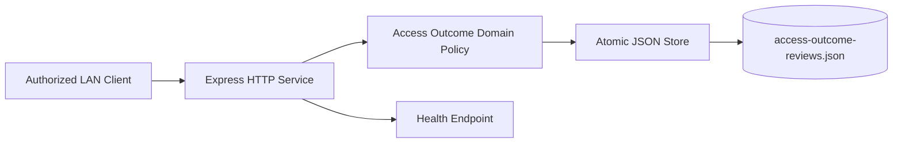
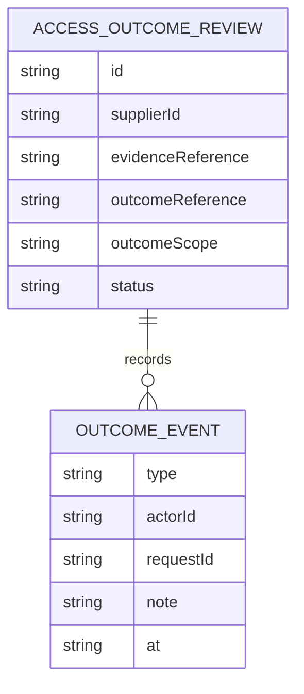
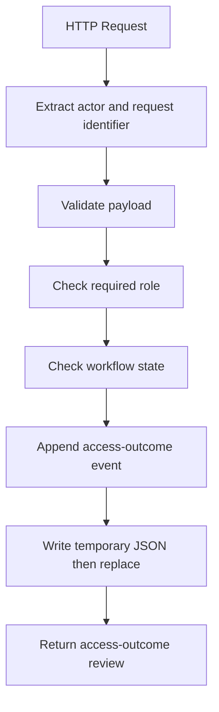
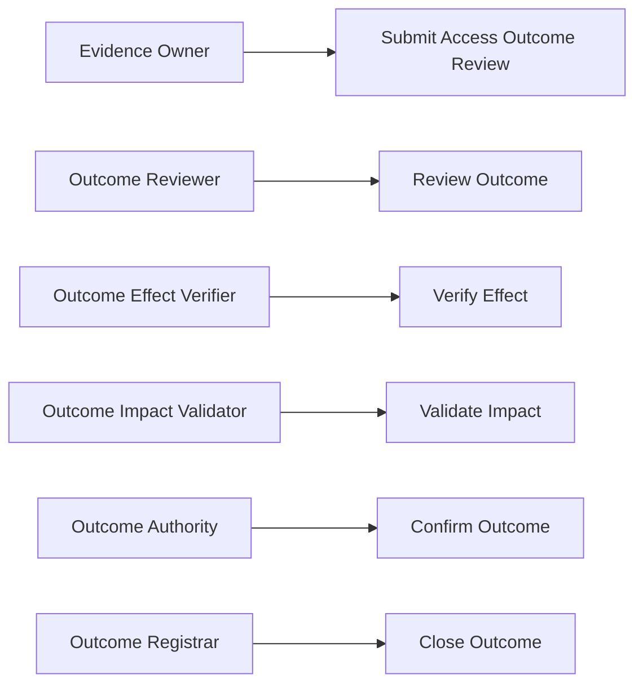
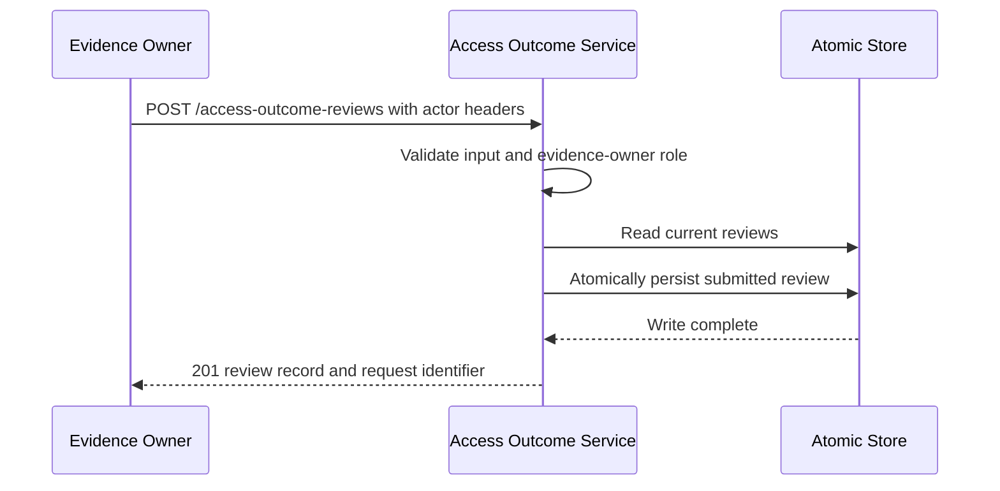

# Supplier Evidence Access Outcome Assurance Platform

## The Problem

Supplier evidence access outcomes become difficult to verify when operational effects, impact evidence, and final closure are handled informally. Without independent control points, organizations cannot establish whether an outcome occurred as expected or whether its impact was reviewed before closure.

## The Solution

This service records an access-outcome review through five independent roles: outcome reviewer, outcome-effect verifier, outcome-impact validator, outcome authority, and outcome registrar. The domain layer enforces a monotonic lifecycle, requires the responsible role for each transition, validates input before mutation, retains state on rejected requests, and persists accepted records using atomic JSON replacement.

## Live Demo and Tech Stack

This repository provides a runnable HTTP service for controlled local-network use. The default port is `65037`, and the process binds to `0.0.0.0`.

| Area | Implementation |
| --- | --- |
| Runtime | Node.js 22 with ECMAScript modules |
| HTTP service | Express 5 |
| Tests | Vitest and Supertest |
| Persistence | Atomic JSON file replacement |
| Delivery controls | GitHub Actions, static checks, and production dependency audit |

## Local Setup and Run Instructions

Use Node.js 22 or later.

```bash
git clone https://github.com/kholipha-ahmmad-al-amin/supplier-evidence-access-outcome-assurance-platform.git
cd supplier-evidence-access-outcome-assurance-platform
npm ci
npm run check
npm test
npm start
```

Confirm readiness from a second terminal:

```bash
curl http://127.0.0.1:65037/health
```

Submit an access-outcome review as the evidence owner:

```bash
curl -X POST http://127.0.0.1:65037/access-outcome-reviews \
  -H 'content-type: application/json' \
  -H 'x-actor-id: supplier-evidence-owner' \
  -H 'x-actor-role: evidence_owner' \
  -H 'x-request-id: outcome-submit-0001' \
  -d '{"supplierId":"SUP-834","evidenceReference":"EVD-834","outcomeReference":"OUT-834-ACCESS-01","outcomeScope":"evidence_access_outcome"}'
```

Advance the record in order with `reviewOutcome`, `verifyEffect`, `validateImpact`, `confirmOutcome`, and `closeOutcome`. Each transition is a `POST` to `/access-outcome-reviews/{id}/{action}` with a non-empty JSON `note`, a unique actor identifier, and the role required by that action.

Run `npm audit --omit=dev --audit-level=high` to evaluate production dependencies. This command evaluates production packages only. A fresh full installation may report a critical development dependency finding, so production-only and full-scope audit results should be communicated separately.

## System Documentation

### System Architecture Diagram



### Entity-Relationship Diagram



### Data Flow Diagram



### Use Case Diagram



### Sequence Diagram



## Owner

Created and maintained by Kholipha Ahmmad Al-Amin.

Software Engineer and AI Specialist

Founder and CEO of EquiSaaS BD

Principal Consultant at AR IT Consultancy

Full Stack Developer and SaaS Product Builder

### Official links

Portfolio: https://kholipha-ahmmad-al-amin.equisaas-bd.com/

GitHub: https://github.com/kholipha-ahmmad-al-amin

LinkedIn: https://www.linkedin.com/in/kholipha-ahmmad-al-amin

X: https://x.com/al_amin5519

Facebook: https://www.facebook.com/kholipha.ahmmad.al.amin

Instagram: https://www.instagram.com/kholipha.ahmmad.al.amin

## Ownership

This project was created and is maintained by Kholipha Ahmmad Al-Amin.
